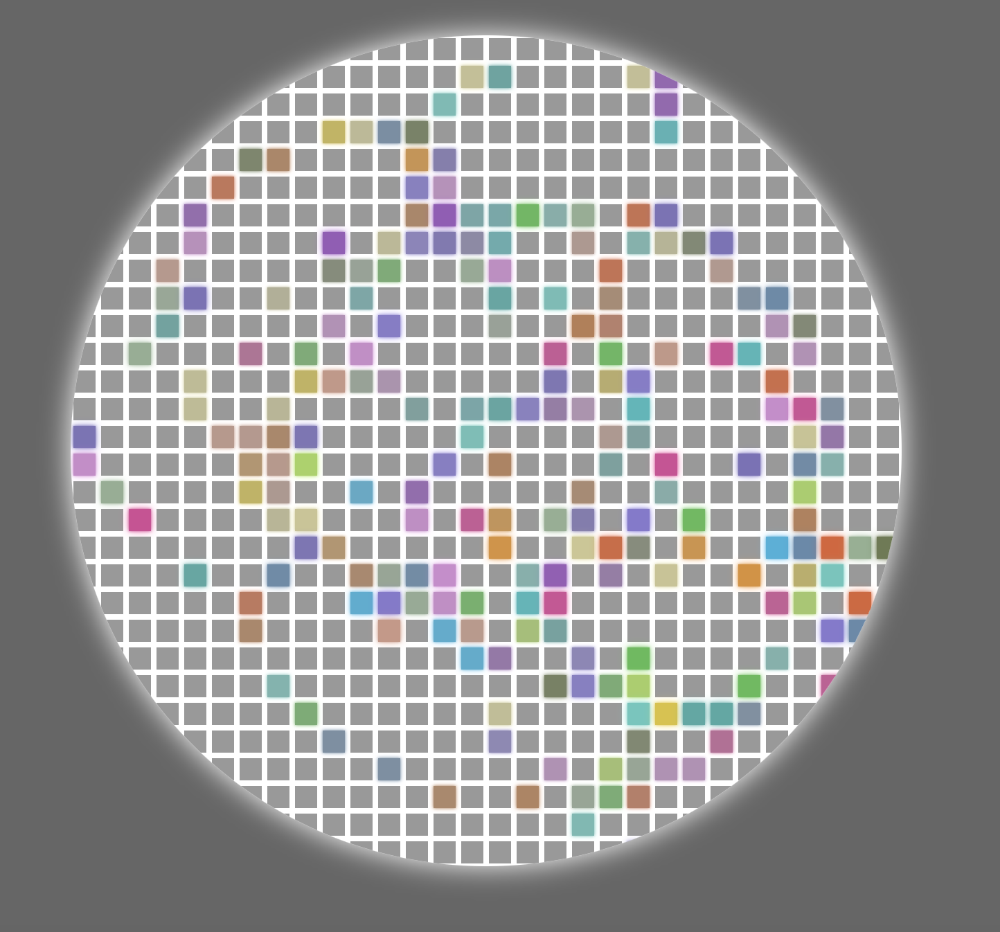

# MovingLine Interative Board
Project working link: https://jellu28.github.io/Moving-line/

An interactive, circular board of squares that react to mouse movements with vibrant colors and glowing effects.

## 🧠 Features
- **Dynamic Interaction**: Squares light up instantly when the mouse hovers over them.
- **Random Color Palette**: Each interaction picks a random color from a curated list of 20 vibrant HEX codes.
- **Fade-out Effect**: Colors smoothly fade back to the original state after the mouse leaves, creating a "trail" effect.
- **Responsive Design**: The board automatically scales down for smaller screens (mobile-friendly).
- **Circular Aesthetics**: A unique round container with a soft outer glow.

## 🛠️ Built With
- **HTML5**
- **CSS3** (Flexbox, Transitions, Media Queries)
- **Vanilla JavaScript** (DOM Manipulation, Dynamic Event Listeners)

## 🗝 How To Use
The script dynamically generates **1,000 squares** inside a circular container. 
- `mouseover`: Triggers a function to pick a random color and apply a matching `box-shadow` for a glow effect.
- `mouseleave`: Resets the background color with a 2-second transition for a smooth disappearing animation.

## 📱 Compatibility
- **Desktop**: Full interactive experience with mouse hover.
- **Mobile**: Responsive layout included (max-width: 540px), though hover effects work best with a cursor.

## 🔧 Setup
1. Clone the repository.
2. Open `index.html` in your browser.
3. Hover your mouse over the board to start drawing!
